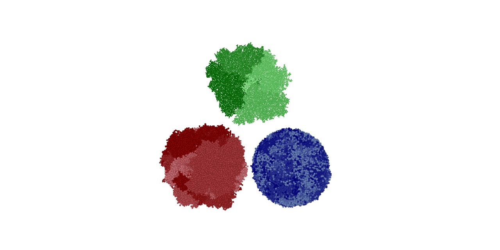
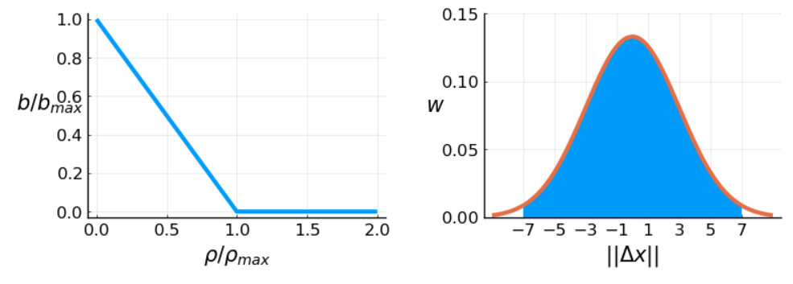
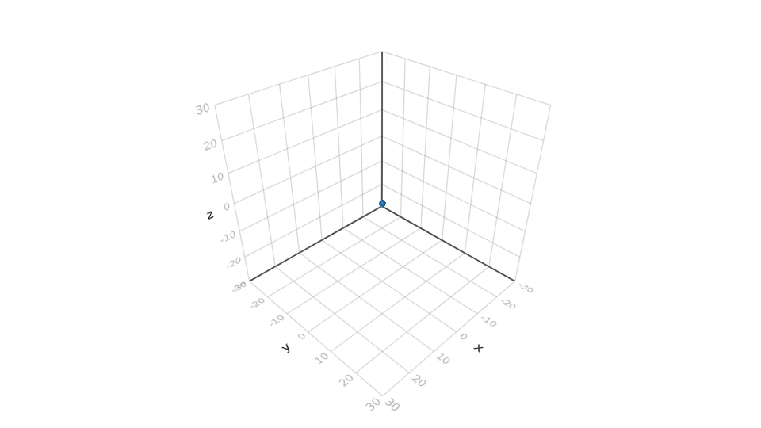
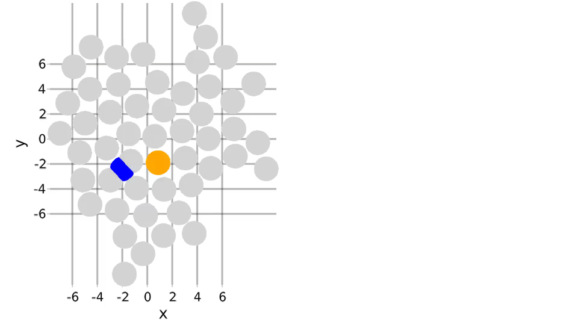
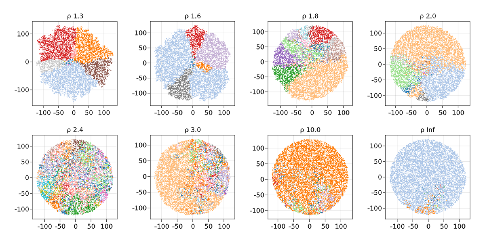
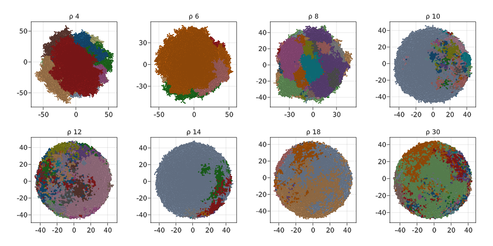

# TumorGrowth
***A cell-based off-lattice model of spatially constraint tumor growth in 2d and 3d.***

>See *test.jl* file for usage.\
>Add the package to a julia environment or test within the package's own environment as in the *test.jl* file.

We define an agent-based off-lattice computational model of neutral tumor growth with spatial restriction. It is based on a time continuous many type branching process well known from population genetics theory of asexuals. An individual cell can die, divide and acquire neutral mutations at division. The events are drawn by a rejection kinetic Monte Carlo algorithm (see box below) [1]. The rate of cell death as well as mutation at division is the same for all within the population. However, an individual cells birth rate `b` depends on the local density `ρ` and the dependence is set by a profile `b(ρ)`. The local density is computed as a weighted sum over cells in proximity, each contributing a Gaussian weight `w` by their distance `ρ(x) = ∑ᵢ w(| xᵢ - x |)`. The profile is such that `b` is maximal at `ρ = 0` and goes to zero at a set density threshold `ρ_thresh`. Thus we obtain **bulk-driven** growth by setting a high threshold `ρ_thresh → ∞` and **surface-driven** growth for a low value of `ρ_thresh`. By tuning this parameter we can continuously vary the mode of growth between Eden-like and unconstrained growth.

 
***Density-dependent birthrate -***

Cells are uniformly drawn which allows us to update a cells birth rate only when it is selected. On the other hand, a cell with low birth rate might also get rejected, i.e. neither die nor divide. Time steps are exponentially distributed random variables with total rate as mean, `τ ∼ Exp( 1/[(b_max + d)⋅ N])` where `b_max = b(ρ=0)` and `N` is the current population size.

> - pick a cell `i` uniformly
> - update cell birth rate `b_i = b(ρ)`
> - draw 'r' uniformly from the interval `(0, b_{max} + d)`
>    - `r < d` : cell dies
>    - ` d < r< b_i + d` : cell divides  
>        ⇒ each cell draws new mutations `m ∝ Poisson(μ)`  
>        ⇒ resolve overlaps by pushing  
>    - `b_i + d < r < b_max + d` : cell skips its turn
> - increment time by `Δt ∝ Exp( 1/[(b_{max} + d) ⋅ N] )`

*Algorithm for density dependent off-lattice tumor growth*

  
***Recorded surface driven growth -***

**Cell birth and mutation -** At birth a new cell is placed on the dividing cell's surface and the population is resolved for overlaps by pushing overlapping cells away from each other. This step in the algorithm is by far the most computationally intensive one and keeping track of immediate neighbourhoods is essential to pushing the time required to simulate `10^4` cells down to a few minutes. The detection of neighbourhoods is simultaneously used in determining a cells birth rate.
The number of mutations at division is Poisson distributed with the mutation `μ` rate as the mean for both offspring cells respectively. Mutations are neutral and they do not affect the birth rate and spatial dynamics.

  
***Pushing algorithms -***

## Sampling and sequencing
The choice of sampling scheme is known to affect the observed subclonal profile [2]. To construct the SFS a large bulk sample representative of the whole tumor is required. However in order to account for spatial heterogeneity many regions of the tumor need to be sampled.
As part of the model package we implemented different methods of sampling. In particular, motivated by the experimental analysis in Ling et al. [3], we cut 2d planes out of 3d tumors and take punch samples on an automatically generated triangular lattice. Sample size and spacing are adjustable and the lattice allows for dense packing and thus high coverage. The resulting sampled clonal map is shown in figure below.

Stochastic sequencing of samples imitates the output of next generation sequencing methods. Consider a mutation at a particular site in the tumor genome occurring in a given sample with frequency `f`.

Coverage `c` is the total number of reads for that site within the sample. By default it is assumed to be a Poisson distributed random variable  with the desired read depth `D` as its mean `c ∼ Poisson(D)`. However, the coverage distribution observed from the data of Ling et al. [3] is strongly skewed and we use a similar distribution to compare simulated SFS to the experimental data. Alternate reads `r` reporting the mutation are taken as a binomial trial with success probability `f` and `c` repetitions `r ∼ Binom(p=f, n=c) `. The fraction of alternate reads `r/c` is called the Variant Allele Frequency (VAF). Finally, due to sample contamination with normal tissue mutant frequencies have to be corrected for sample purity `p`, giving the mutant Cancer Cell Fraction (CCF) `f = r/(c⋅p)`. The whole tumor mutant frequency is given by the mean VAF over the mean purity averaged over samples `̄f = <r/c> / 
`.

 
***Simulated tumor growth -***

 
 
***Transition from surface to bulk driven growth -***

## References

1. *Marc  J.  Williams;  Benjamin  Werner;  Timon  Heide;  Christina  Curtis;  Chris  PBarnes; Andrea Sottoriva and Trevor A Graham. Quantification of subclonal selec-tion in cancer from bulk sequencing data.  2018.*

2. *Kate Chkhaidze; Timon Heide; Benjamin Werner; Marc J. Williams; Weini Huang;Giulio  Caravagna;  Trevor  A.  Graham;  Andrea  Sottoriva.   Spatially  constrainedtumour growth affects the patterns of clonal selection and neutral drift in cancergenomic data.  2019.*

3. *Shaoping  Ling,  Zheng  Hu,  Zuyu  Yang,  Fang  Yang,  Yawei  Li,  Pei  Lin,  Ke  Chen,Lili Dong, Lihua Cao, Yong Tao, Lingtong Hao, Qingjian Chen, Qiang Gong, DafeiWu, Wenjie Li, Wenming Zhao, Xiuyun Tian, Chunyi Hao, Eric A. Hungate, DanielV.  T.  Catenacci,  Richard  R.  Hudson,  Wen-Hsiung  Li,  Xuemei  Lu,  and  Chung-IWu.   Extremely  high  genetic  diversity  in  a  single  tumor  points  to  prevalence  ofnon-darwinian  cell  evolution.Proceedings of the National Academy of Sciences,112(47):E6496–E6505, nov 2015.*
